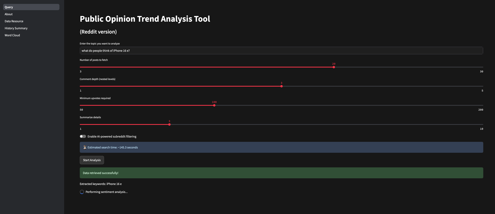
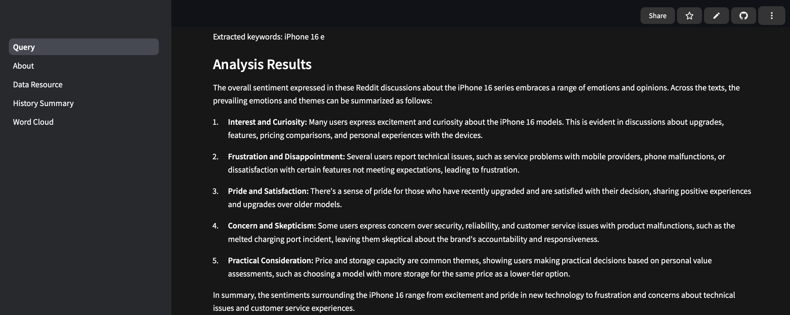
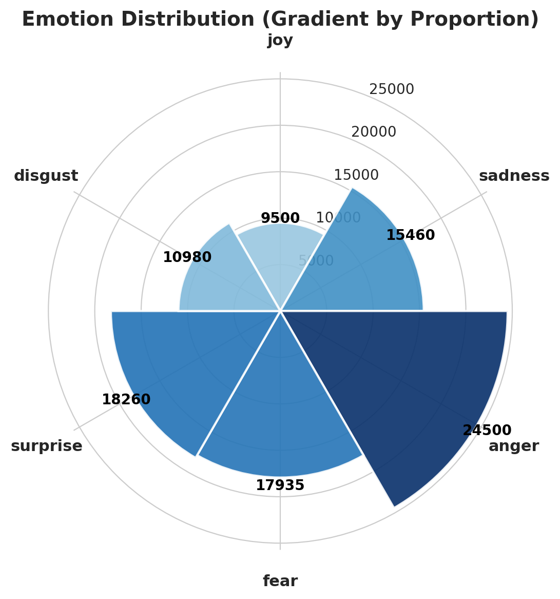
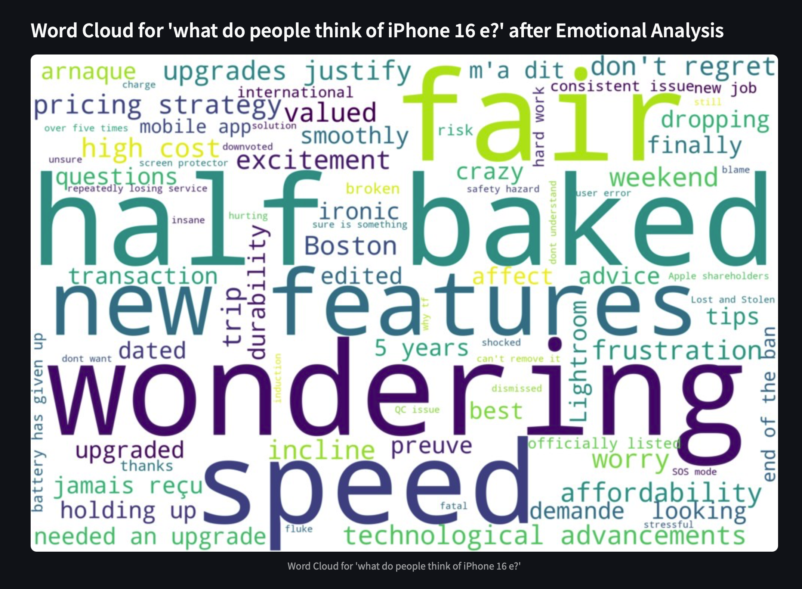
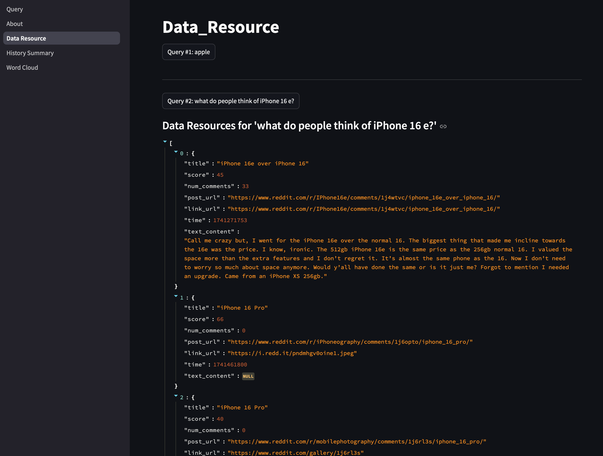
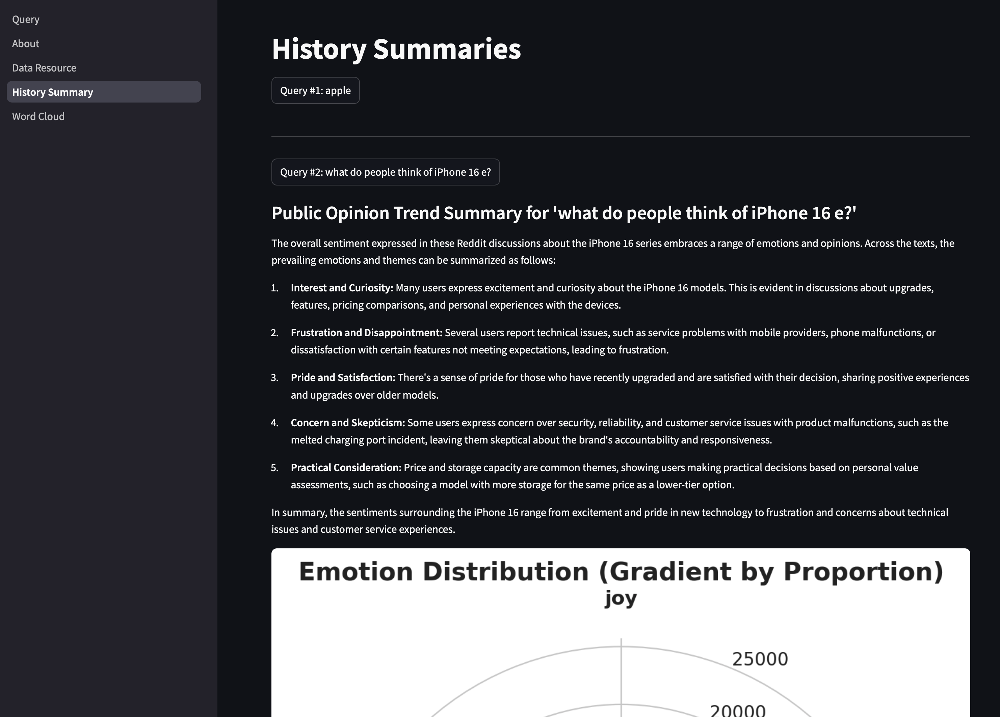

# Online Public Opinion Monitoring Dashboard

## Background  
Understanding public opinion in real-time is critical in today's fast-moving world.  
This app provides a **streamlined way to analyze online discussions**, extract **key insights**, and visualize **public sentiment trends** in an interactive dashboard.  

### **Why this project?**  
- **📊 Tracking Public Sentiment Trends**  
- **⏳ Saving Time for Users**  
- **✨ Automatically Summarizing Discussions**  

Currently, the app **collects publicly available discussions from Reddit**.  
*(As a demo, this is sufficient, but future versions may integrate more open data sources.)*  

---

## How to Use the App  

### ** Method 1: Use the Deployed Version**  
**Visit the live app here**:[Online Public Opinion Monitoring Dashboard](https://online-public-opinion-monitoring-dashboard-tengfengshi.streamlit.app)

### ** Method 2: Run Locally**  

#### **1️ Clone the repository**  
```bash
git clone https://github.com/Fengshi-Teng/Online-Public-Opinion-Monitoring-Dashboard.git
cd path to Online-Public-Opinion-Monitoring-Dashboard
```
#### **2 install the required dependencies** 
```bash
pip install -r requirements.txt
```
#### **3️ Run the Streamlit App**
```bash
streamlit run Query.py
```
## Features & Functionality
### **1️ Query & Configuration**
- Input your topic of interest
- Customize: Search range, comment depth, filtering criteria
- Receive an estimated search time
- Click "Start Analysis"


### **2️ Results (Summarization & Rose Chart)**
- AI-generated summary of discussions
- Sentiment distribution displayed in a Rose Chart



### **3️ Word Cloud Visualization**
- Check word clouds of queried results
- Compare raw text vs. sentiment-filtered word clouds
    You will notice that sentiment-filtered word clouds reveal more emotional tendencies and opinions, whereas those generated from raw text remain more neutral.



### **4️ Data Source View**
- Inspect the actual Reddit data sources behind the analysis


### **5️ History Summaries**
- View past queries and corresponding sentiment analyses


## Project Structure
```
📁 Online-Public-Opinion-Monitoring-Dashboard
│── 📂 pages                # Streamlit page modules
│   ├── About.py            # About section with project details
│   ├── Data_Resource.py     # View data sources
│   ├── History_Summary.py   # History of queries and analysis
│   ├── Word_Cloud.py        # Word cloud visualization
│── 📂 utils                # Utility functions
│   ├── analysis.py         # Sentiment analysis & AI processing
│   ├── data_source.py      # Reddit API integration
│   ├── display.py          # Visualization functions
│   ├── ui.py               # UI-related elements
│   ├── style.css           # Custom styling for Streamlit UI
│── Query.py                # Main entry point for the app
│── requirements.txt        # Required dependencies
│── README.md               # Documentation
```
## Future Improvements
- 💨 Speed Optimization: Implementing caching & parallel processing
- 🌍 Expanding Data Sources: Adding Twitter, news, or other sources
- 🧠 AI-Powered Agents (LangChain): Using LangChain & OpenAI Agents for:
- Conversational Querying (Chat with data)
- Dynamic Topic Discovery
- More advanced NLP-based filtering

## Feedback & Contributions
If you have any suggestions, feel free to open an issue or contribute to the repository!